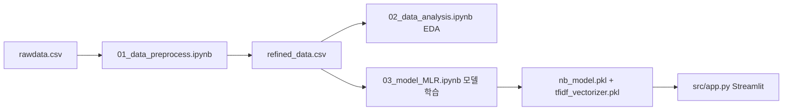

# AI·사람 텍스트 판별 프로젝트: 네 가지 모델이 의미하는 것 (코드 기준)

이 문서는 레포 안의 실제 코드(`01_data_preprocess.ipynb`, `02_data_analysis.ipynb`, `03_model_MLR.ipynb`, `src/app.py`)를 기준으로, **어떤 순서로 데이터가 흐르는지**, **네 가지 기법이 각각 무엇을 하는지**, **그래프는 무엇을 말하는지**를 발표·보고용으로 정리한 것입니다.

---

## 1. 한 줄로 요약

| 구분 | 다중선형회귀 (MLR) | 나이브 베이즈 (NB) | 랜덤 포레스트 (RF) | XGBoost |
|------|-------------------|-------------------|-------------------|---------|
| **입력** | 숫자 5개 특성 | **TF-IDF로 만든 단어 가방** (최대 3000차원) | 숫자 5개 특성 | 숫자 5개 특성 |
| **하는 일** | “통계적 특성으로 라벨을 **선형**으로 근사” | “어떤 단어 조합이면 사람/AI인지 **확률**로 분류” | “여러 트리로 **비선형** 규칙 학습” | “부스팅 트리로 **비선형** 분류 + 특성 중요도” |
| **배포 앱** | 사용 안 함 | **`app.py`에서 사용** (`nb_model.pkl` + `tfidf_vectorizer.pkl`) | 사용 안 함 | 노트북에서 비교·저장만 (선택) |

**중요:** XGBoost는 **전처리 도구가 아니라 분류 모델(머신러닝)**입니다. 전처리는 `01` 노트북의 불용어 제거·특성 계산, 그리고 나이브 베이즈 앞단의 **TF-IDF 벡터화**가 담당합니다.

---

## 2. 데이터가 만들어지는 순서 (전체 파이프라인)

아래는 코드와 파일 이름에 맞춘 **실행 순서**입니다.

1. **`01_data_preprocess.ipynb`**  
   - 원본 `text`, `label` 등을 읽고, 컬럼명을 한글로 정리합니다.  
   - 각 행(문서)마다 **불용어 제거된 문자열**, **문장_길이**, **단어_개수**, **단어_평균길이**, **어휘_다양성**, **단어_밀도**, **특문_개수** 등을 만듭니다.  
   - 결과가 `../data/processed/refined_data.csv` 로 저장됩니다 (코드 기준 약 44,868행 × 11열).

2. **`02_data_analysis.ipynb`**  
   - 상관·VIF·EDA 리포트 등 **탐색적 분석** (모델 학습의 “준비 단계”).

3. **`03_model_MLR.ipynb`**  
   - 같은 `refined_data.csv`를 읽고, **네 가지 모델**을 순서대로 학습·평가합니다.

4. **`src/app.py`**  
   - **나이브 베이즈 + TF-IDF**만 로드해, 사용자가 입력한 문장을 **AI/사람 확률**로 보여줍니다.

---

## 3. 한 행(한 문서)이 코드에서 어떻게 보이는지

`refined_data.csv`의 각 행은 대략 다음과 같은 의미를 가집니다.

| 컬럼 | 의미 (코드/도메인) |
|------|-------------------|
| `텍스트` | 원문 에세이 등 |
| `라벨` | **0 = 사람 작성**, **1 = AI 생성** (이진 분류의 정답) |
| `불용어_제거` | 토큰화·불용어 제거 등을 거친 **문장 문자열** (남은 단어들로 이어진 텍스트) |
| `문장_길이`, `단어_개수`, … | 문서 통계 특성 (숫자) |

**예시 (개념 설명용):**  
한 행의 `라벨`이 1이고, `문장_길이`가 크고 `어휘_다양성`이 낮다면, “AI가 쓴 긴 문장일 수 있다” 같은 **패턴**을 모델이 학습할 수 있습니다. 실제 수치는 데이터마다 다릅니다.

---

## 4. `03_model_MLR.ipynb` 안에서의 처리 순서 (셀 단위)

노트북은 **위에서 아래로** 실행된다고 가정할 때:

1. **데이터 로드**  
   `df = pd.read_csv('../data/processed/refined_data.csv')`

2. **공통 타깃**  
   `y = df['라벨']` (0 또는 1)

3. **다중선형회귀 (MLR)**  
   - 입력: 숫자 특성 5개  
     `['문장_길이', '단어_평균길이', '어휘_다양성', '단어_밀도', '특문_개수']`  
     (`단어_개수`는 다중공선성 때문에 제외했다고 주석에 있음)  
   - `train_test_split(..., test_size=0.2, random_state=42)`  
   - `LinearRegression().fit(X_train, y_train)`  
   - **회귀**이므로 예측값은 0~1 사이 실수로 나올 수 있음 (이진 라벨을 연속값으로 맞추는 형태).

4. **나이브 베이즈 (NB)**  
   - 입력: `df['불용어_제거']` 문자열에 대해  
     `TfidfVectorizer(stop_words='english', max_features=3000)`  
   - `MultinomialNB().fit(X_train_v, y_train_v)`  
   - `joblib.dump(nb_model, 'nb_model.pkl')`, `joblib.dump(vectorizer, 'tfidf_vectorizer.pkl')`  
   → **이 두 파일이 Streamlit 앱이 읽는 파일**입니다.

5. **랜덤 포레스트 (RF)**  
   - 노트북에서는 **MLR과 동일한 `X_train`, `X_test`**(숫자 5특성)를 사용합니다.  
   - `GridSearchCV`로 `n_estimators`, `max_depth` 탐색 후 최적 모델로 예측.  
   - 혼동 행렬 히트맵으로 시각화.

6. **XGBoost**  
   - 역시 **같은 `X_train`, `X_test`**(숫자 5특성)에 `XGBClassifier`를 학습합니다.  
   - `objective='binary:logistic'` → **이진 분류** 모델.  
   - 특성 중요도(모델 내장) + 퍼뮤테이션 중요도 그래프.

즉, **텍스트(TF-IDF)를 쓰는 건 나이브 베이즈 블록뿐**이고, RF·XGB는 **이미 뽑아 둔 숫자 특성 5개**로 학습합니다.

---

## 5. 기법별로 “무엇을 찾는 분석인가” (발표용 문장 예시)

### 5.1 다중선형회귀 (Multiple Linear Regression)

- **분석 기법:** 회귀분석. 종속변수를 **선형 조합**으로 설명합니다.  
  여기서는 종속변수가 사실상 **이진 라벨(0/1)** 이라서, 엄밀히는 “로지스틱 회귀”가 전통적이지만, 코드는 **선형회귀로 0~1 근처를 예측**하는 방식입니다.

- **이 데이터에서 무엇을 찾나:**  
  “**문장 길이, 어휘 다양성, 단어 밀도 같은 통계적 특성만으로** AI 글(1)과 사람 글(0)을 **가중치(계수)** 로 얼마나 설명할 수 있는가?”

- **코드에서 나온 수치 예 (노트북 출력 기준):**  
  - 각 특성마다 **계수**가 출력됨 (예: `단어_밀도` 계수의 절대값이 크다면, 그 특성이 라벨과 함께 변하는 방향이 큼).  
  - **R²** (코드에 `r2_score`)는 “통계 특성만으로 라벨 변동을 얼마나 설명하는지”에 대한 지표 (예: 약 0.45면 중간 정도 설명력).

- **그래프 (실제값 vs 예측값 산점도):**  
  - 가로축: 테스트셋의 **실제 라벨** (0 또는 1).  
  - 세로축: 모델이 예측한 **연속값**.  
  - 빨간 점선은 보통 `y=x` 참고선. 점들이 선 근처에 몰리면 예측이 실제와 잘 맞는 것.  
  - **의미:** “숫자 특성만으로는 라벨이 완전히 0/1로 떨어지지 않고 퍼져 있음”을 시각적으로 보여 줌 → 그래서 **텍스트 내용까지 쓰는 NB**가 성능이 더 잘 나올 수 있음.

---

### 5.2 나이브 베이즈 + TF-IDF (MultinomialNB)

- **TF-IDF는 전처리인가, 모델인가?**  
  - **전처리(정확히는 특성 추출):** 원문 → **고정 길이 벡터**(각 차원은 “특정 단어”에 대한 점수).  
  - **모델:** `MultinomialNB`가 그 벡터를 보고 **P(사람|단어들), P(AI|단어들)** 에 가까운 판단을 함.

- **이 데이터에서 어떤 순서로 분석하나 (코드와 동일):**  
  1. 각 행의 `불용어_제거` 문장을 가져온다.  
  2. **TF-IDF**로 “문서마다 단어 중요도 벡터”를 만든다 (최대 3000 단어 차원, 영어 불용어 제거).  
  3. **다항 나이브 베이즈**는 “단어 빈도(비슷한 스케일)를 가정한 단순한 확률 모델”로, 클래스(0/1)별 단어 분포를 학습한다.  
  4. 새 문장이 오면 같은 벡터라이저로 변환 후 → 어떤 클래스 확률이 큰지 예측.

- **발표용 한 문장 예:**  
  “**단어의 등장 패턴(TF-IDF)** 을 숫자 벡터로 바꾼 뒤, **나이브 베이즈**가 ‘이런 단어 조합이면 사람 글일 확률이 높다’는 식으로 **확률적 분류**를 합니다.”

- **그래프:** 노트북 출력은 주로 **분류 리포트·정확도**이며, 앱에서는 `st.progress`로 **AI일 확률**을 막대로 보여 줍니다.  
  - **의미:** 확률이 0.5를 넘으면 AI 쪽으로 기울었다고 해석할 수 있음.

---

### 5.3 랜덤 포레스트 (RandomForestClassifier)

- **분석 기법:** **앙상블(여러 결정 트리)**. 숫자 특성만으로도 **비선형 경계**(예: “길이는 긴데 밀도만 낮으면 AI” 같은 조합)를 학습할 수 있음.

- **이 데이터에서 무엇을 찾나:**  
  “**통계 5특성**만으로 트리 다수를 조합하면, 선형 회귀보다 **정확도·F1**이 어떻게 달라지는가?”

- **그래프 (혼동 행렬):**  
  - 행: **실제** (사람/AI), 열: **모델 예측**.  
  - 대각선 숫자가 클수록 맞춘 개수.  
  - **의미:** 사람을 AI로 틀리거나(0→1), AI를 사람으로 틀리는(1→0) **오류 패턴**을 한눈에 볼 수 있음.

---

### 5.4 XGBoost (XGBClassifier)

- **전처리인가?**  
  - **아닙니다.** `XGBClassifier`는 **그래디언트 부스팅** 기반의 **지도 학습 분류 모델**입니다.  
  - 이 프로젝트에서는 **입력이 숫자 5특성**이고, `objective='binary:logistic'` 이므로 **이진 분류**를 수행합니다.

- **이 데이터에서 무엇을 하나:**  
  - 약한 트리를 순차적으로 쌓아 오차를 줄이면서, **사람/AI를 구분하는 규칙**을 학습합니다.  
  - **특성 중요도** 그래프: 모델이 분할할 때 어떤 특성(문장_길이 등)을 많이 썼는지.  
  - **퍼뮤테이션 중요도**: 특성 값을 무작위로 섞었을 때 **정확도가 얼마나 떨어지는지**로 “진짜 유용한지”를 보조적으로 확인.

- **발표용 한 문장 예:**  
  “XGBoost는 **문장 길이·어휘 다양성 같은 수치 특성**을 넣으면, 트리 부스팅으로 **복잡한 경계**를 학습하는 **분류 모델**이며, **어떤 특성이 판별에 중요했는지**를 그래프로 해석할 수 있습니다.”

---

## 6. 왜 나이브 베이즈만 TF-IDF를 쓰는가 (흔한 오해 정리)

- **오해:** “모든 모델이 TF-IDF로 문장을 임베딩한다.”  
- **코드상 사실:**  
  - **NB:** `불용어_제거` → TF-IDF → `MultinomialNB`.  
  - **MLR / RF / XGB:** `features` 리스트의 **숫자 열만** 사용.  
- 따라서 “**단어 내용**”까지 직접 쓰는 건 **나이브 베이즈 경로**이고, 나머지는 “**문서 통계**”만으로 비교 실험한 것에 가깝습니다.

---

## 7. Streamlit 앱의 실제 시퀀스 (`src/app.py`)

1. `nb_model.pkl`, `tfidf_vectorizer.pkl` 로드.  
2. 사용자가 텍스트 입력.  
3. `vectorizer.transform([user_input])` → **학습 때와 같은 TF-IDF 공간**으로 변환.  
4. `model.predict` / `predict_proba` → 클래스(0/1)와 확률.  
5. UI에 문구·진행 바로 표시.

여기서는 **전처리 파이프라인이 `app.py` 안에 길게 있는 것이 아니라**, 이미 학습된 **벡터라이저가 “전처리를 고정”**해 두고, 새 문장만 같은 규칙으로 숫자 벡터로 바꾸는 구조입니다.

---

## 8. 노트북 마지막 셀의 주의 (버전·재현성)

`03_model_MLR.ipynb` 끝부분에서 `joblib.dump(vectorizer, 'tfidf_vectorizer.pkl')`를 **다시** 저장하는 코드가 있으면, **나이브 베이즈용으로 맞춰 둔 벡터라이저**가 덮어씌워질 수 있습니다. 배포용으로는 **NB 학습 직후 저장한 `tfidf_vectorizer.pkl`**과 **같은 학습 스크립트**를 쓰는 것이 안전합니다.

---

## 9. 빠른 참고: 용어 정리

| 용어 | 한 줄 설명 |
|------|-----------|
| **전처리** | 불용어 제거, 특성 계산, (NB의 경우) TF-IDF 변환 |
| **특성 (feature)** | 모델에 들어가는 입력 열. 숫자 5개 또는 TF-IDF 벡터 |
| **모델** | MLR, NB, RF, XGB처럼 **입력→예측**을 학습하는 객체 |
| **TF-IDF** | 단어에 “이 문서에서는 얼마나 중요한가” 점수를 매기는 벡터화 |
| **XGBoost** | **분류/회귀 모델** 라이브러리; 이 프로젝트에서는 **이진 분류**에 사용 |

---

*문서 생성 기준: 레포의 `src/03_model_MLR.ipynb`, `src/01_data_preprocess.ipynb`, `src/app.py` 내용과 일치하도록 작성했습니다. 숫자 예시는 노트북을 다시 실행하면 출력값이 조금 달라질 수 있습니다.*
